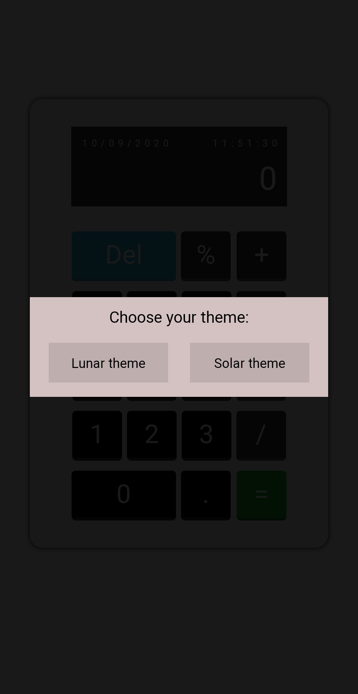
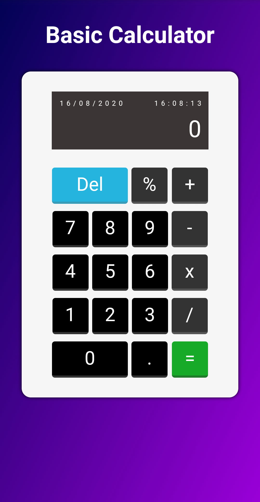
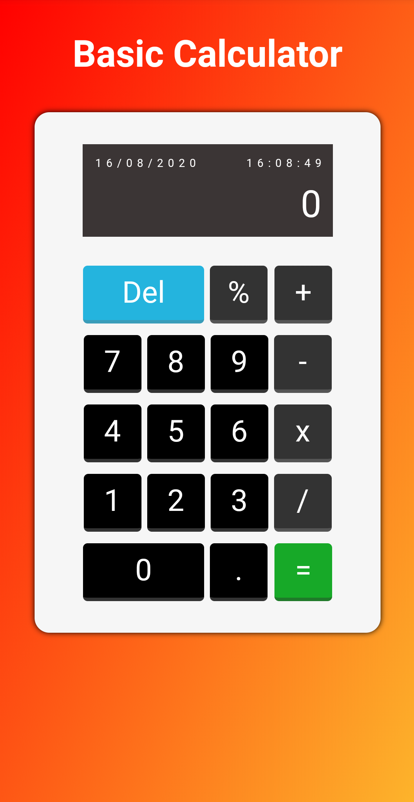

<p align="center">	
<a href="https://www.linkedin.com/in/ediberto-b-oliveira-872926178/">
  
  </a>
  

  <a aria-label="Completed" href="https://edibertooliveira.github.io/Basic-Calculator/">
    </img>
  </a>
  <a href="https://github.com/edibertooliveira/Basic-Calculator/commits/master">
    
  </a> 

  <a href="https://github.com/edibertooliveira/Basic-Calculator/master/LICENSE">
    
  </a>
  
   <a href="https://github.com/edibertooliveira/Basic-Calculator/stargazers">
    
  </a>
</p>

# Basic-Calculator

### Web Screenshot

<div style="display: flex; flex-direction: 'row'; align-items: 'center';">
   
   
   
</div>

> :rocket: Calculator Developed With Html5,CSS3 & JavaScript: The goal will be to program it only with pure javascript.

### :pushpin: Table of Contents

* [Technologies](#computer-technologies)
* [Features](#rocket-features)
* [How to Run](#construction_worker-how-to-run)
* [Found a bug? Missing a specific feature?](#bug-issues)
* [License](#closed_book-license)

### :computer: Technologies
This project was made using the follow technologies:
<ul>
  <li><a href="https://developer.mozilla.org/">HTML5</a></li>
  <li><a href="https://css-tricks.com/">CSS3</a></li>
  <li><a href="https://www.javascript.com/">Javascript</a></li>
</ul>

### :rocket: Features

* Calculadora basica, mais bem completa.
* Aplicativo fácil de usar sem precisar baixar ou abrir softweres apenas do navegador.

### :construction_worker: How to run
```bash
# Clone Repository
$ git clone https://github.com/edibertooliveira/Basic-Calculator.git
```

### :bug: Issues
Feel free to **file a new issue** with a respective title and description on the the [Basic-Calculator](https://github.com/edibertooliveira/Basic-Calculator/issues) repository. If you already found a solution to your problem, **i would love to review your pull request**!

### :closed_book: License
Released in 2020 :closed_book: License

Made with love by [Ediberto Oliveira](https://github.com/edibertooliveira/) 🚀.
This project is under the [MIT license](https://github.com/edibertooliveira/Basic-Calculator/master/LICENSE).

Give a ⭐️ if this project helped you!
